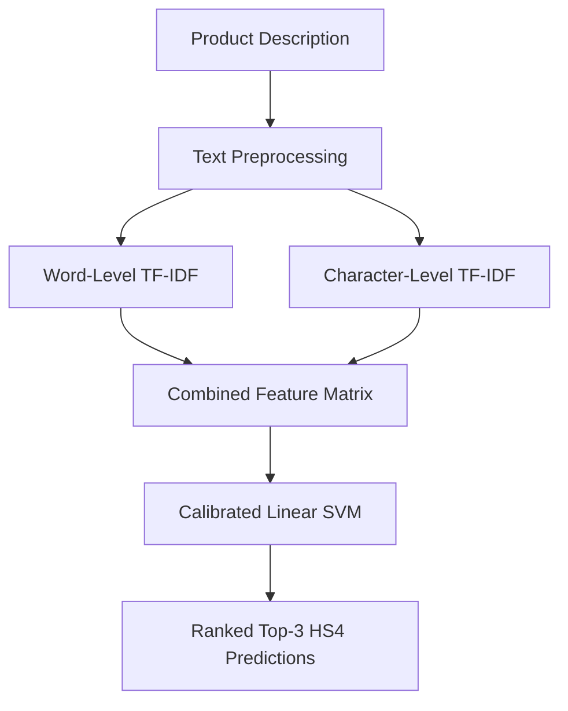

# HS4 Code Prediction

### Product Classification using Word + Character TF-IDF and Calibrated Linear SVM

An NLP-based machine learning project that predicts the **4-digit Harmonized System (HS4) heading** from a product description.

The model returns a ranked list of three candidate codes with estimated confidence scores, helping a human reviewer explore possible classifications instead of relying on a single automatic decision.

## 🚀 Live Demo

**[Try the HS4 Code Prediction App](https://hs4-code-prediction-wampk2tvldwfbcgrfjmkfy.streamlit.app/)**

Enter a product description to explore the model's top three predicted HS4 headings and their estimated confidence scores.

## 📌 Project Overview

Product classification involves identifying relevant tariff headings from product descriptions. This project explores how Natural Language Processing (NLP) and machine learning can support this task.

### Workflow

## 📊 Model Performance

The final model was evaluated on **2,976 held-out test samples** across 252 HS4 classes.

| Metric                           |     Result |
| -------------------------------- | ---------: |
| Top-1 Accuracy                   | **69.62%** |
| Top-3 Accuracy                   | **81.69%** |
| Macro F1-score                   | **0.5906** |
| Test Samples                     |      2,976 |
| HS4 Classes                      |        252 |
| Majority-Class Baseline Accuracy |      7.09% |

**Top-1 accuracy** measures how often the first prediction matches the correct HS4 heading.

**Top-3 accuracy** measures how often the correct heading appears among the model's three highest-ranked predictions.

## 🗂️ Dataset

The project uses the training split of a publicly available conversational tariff-classification dataset.

* Dataset used: [CROSS Rulings HTS Dataset on Hugging Face](https://huggingface.co/datasets/Dayanand314Krishna/cross_rulings_hts_dataset_for_tariffs)
* Original dataset: [Flexify.AI CROSS Rulings HTS Dataset](https://huggingface.co/datasets/flexifyai/cross_rulings_hts_dataset_for_tariffs)

**Required dataset attribution:**

> CROSS Rulings HTS Dataset for Tariff Classification by Flexify.AI Inc. (https://www.flexify.ai)

The original data contains conversational examples in a `messages` field. Product descriptions and associated tariff codes are extracted to build a text-classification dataset.

### Data Preparation

| Processing stage                         |    Records |
| ---------------------------------------- | ---------: |
| Original parsed records                  |     18,254 |
| Valid descriptions and codes             |     18,233 |
| After removing conflicting descriptions  |     17,509 |
| After exact duplicate removal            |     15,697 |
| Final dataset after rare-class filtering | **14,880** |

The final dataset was divided into:

* Training samples: 11,904
* Test samples: 2,976
* Supported HS4 classes: 252

A stratified train/test split was used to preserve class proportions where possible.

## 🧹 Data Cleaning

The following preprocessing steps were applied:

1. Extract product descriptions and tariff codes from the conversational records.
2. Convert tariff codes into 4-digit HS4 labels.
3. Normalize the text.
4. Remove invalid labels and unsuitable descriptions.
5. Remove conflicting examples where identical descriptions had different labels.
6. Remove exact duplicate description-label pairs.
7. Exclude HS4 classes with fewer than 10 examples.
8. Create a stratified train/test split.

## 🧠 Model and Techniques

### 1. Word-Level TF-IDF

Word-level TF-IDF converts product descriptions into numerical features using words and two-word combinations.

Configuration:

* `ngram_range=(1, 2)`
* `min_df=2`
* `max_features=30000`
* `sublinear_tf=True`

This helps capture product terminology and phrases such as `summer dress`, `stainless steel`, and `rubber parts`.

### 2. Character-Level TF-IDF

Character-level TF-IDF captures patterns within words, including technical terminology, word endings and variations in product descriptions.

Configuration:

* `analyzer="char_wb"`
* `ngram_range=(3, 5)`
* `min_df=2`
* `max_features=30000`
* `sublinear_tf=True`

### 3. Feature Combination

Word-level and character-level features are combined using Scikit-learn's `FeatureUnion`.

This gives the model access to both word-based information and smaller character patterns that may help distinguish product descriptions.

### 4. Calibrated Linear SVM

The final classifier uses `LinearSVC` with:

* `C=1.0`
* `class_weight="balanced"`
* `max_iter=5000`

The classifier is wrapped with `CalibratedClassifierCV` using sigmoid calibration and three-fold cross-validation. This produces probability estimates that can be used to rank the top three candidate HS4 headings.

These estimates are useful for ranking predictions, but they should not be interpreted as guarantees of correctness.

## 🔬 Model Comparison

The final word-plus-character feature model was compared with alternative configurations on the same test split.

| Model                                     | Top-1 Accuracy | Top-3 Accuracy |   Macro F1 |
| ----------------------------------------- | -------------: | -------------: | ---------: |
| Word + Character TF-IDF, calibrated SVM   |     **69.62%** |     **81.69%** |     0.5906 |
| Word-only TF-IDF, calibrated SVM          |         66.70% |         78.80% |     0.5450 |
| Word + Character TF-IDF, uncalibrated SVM |         69.05% |         80.85% | **0.6000** |

Combining word and character features improved Top-1 and Top-3 accuracy compared with the word-only model. The uncalibrated model achieved a slightly higher Macro F1-score, while the selected calibrated model performed better on the Top-1 and Top-3 metrics emphasized by this project.

## 🔎 Error Analysis and Coverage

The project generates prediction files to help inspect the model's performance and understand misclassifications.

* `test_predictions.csv` contains predictions for the held-out test samples.
* `wrong_predictions.csv` contains examples where the first prediction was incorrect.

### Coverage Analysis

| Coverage measure                                          |     Result |
| --------------------------------------------------------- | ---------: |
| Eligible deduplicated records before rare-class filtering |     15,697 |
| Records retained in the final model dataset               |     14,880 |
| Record-level coverage                                     | **94.80%** |
| Distinct source codes identified                          |        548 |
| Distinct codes supported by the model                     |        252 |
| Distinct-code coverage                                    | **45.99%** |

Record-level coverage describes how many eligible records remained after rare-class filtering. Distinct-code coverage shows that many codes found in the source data are not supported by the final model.

The model cannot predict a class that is absent from its learned set of labels.

### Manual Stress Test

A small, manually selected set of 12 product descriptions was used to explore challenging cases. The expected HS4 heading appeared in the model's Top-3 predictions in **7 out of 12 cases (58.33%)**.

This is an exploratory stress test, not a representative benchmark of real-world performance.

### Confidence and Similarity Diagnostics

Additional analysis examined confidence estimates and the similarity between test descriptions and their nearest training descriptions. Accuracy tended to be lower for less familiar descriptions.

The probability estimates are not perfectly calibrated, so they should be treated as ranking aids rather than authoritative confidence guarantees.

## ⚠️ Limitations

* The model predicts only among the HS4 classes represented in its training data.
* Some descriptions are ambiguous or contain multiple products.
* The extraction process selects the first HS4 code identified in an assistant response, which can introduce label noise.
* Some HS4 classes have limited representation.
* The test results do not establish performance on every product category.
* HS4 headings are not complete country-specific tariff codes.

**This project is for portfolio and educational purposes. It is not a substitute for official customs guidance or expert tariff classification.**

## 🛠️ Technologies Used

* Python
* Pandas and NumPy
* Scikit-learn
* Word and Character TF-IDF
* Linear Support Vector Machine
* Probability Calibration
* Hugging Face Datasets
* Joblib
* Streamlit
* Jupyter Notebook / Google Colab

## 📁 Project Files

| File                                                                                                                  | Purpose                                                         |
| --------------------------------------------------------------------------------------------------------------------- | --------------------------------------------------------------- |
| [`hs4_code_classifier.ipynb`](https://github.com/Ayesha-Ansa/hs4-code-prediction/blob/main/hs4_code_classifier.ipynb) | Data preparation, model training, evaluation and error analysis |
| [`app.py`](https://github.com/Ayesha-Ansa/hs4-code-prediction/blob/main/app.py)                                       | Streamlit prediction interface                                  |
| [`requirements.txt`](https://github.com/Ayesha-Ansa/hs4-code-prediction/blob/main/requirements.txt)                   | Python dependencies                                             |
| `model_info.pkl`                                                                                                      | Model metadata                                                  |
| `test_predictions.csv`                                                                                                | Held-out test predictions                                       |
| `wrong_predictions.csv`                                                                                               | Incorrect Top-1 predictions                                     |
| [GitHub Releases](https://github.com/Ayesha-Ansa/hs4-code-prediction/releases)                                        | Downloadable trained model artifact                             |

The trained model is distributed as a GitHub Release asset rather than a regular file in the repository.

## 🔮 Potential Improvements

* Improve coverage for underrepresented HS4 classes.
* Refine extraction for descriptions containing multiple products or codes.
* Explore richer product attributes such as material, function and intended use.
* Add explanations to show which product terms influenced a prediction.
* Explore alternative text representations and deeper HS classification levels where suitable data is available.

## 👩‍💻 Author

**Ayesha Ansari**

Data Science & AI | Machine Learning | NLP
