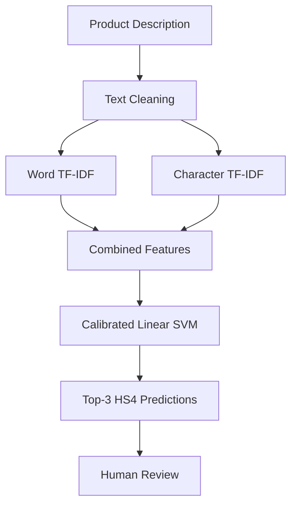

# HS4 Code Prediction

### NLP-Based Product Classification with Calibrated Linear SVM

[](https://hs4-code-prediction-wampk2tvldwfbcgrfjmkfy.streamlit.app/)
[](https://www.python.org/)
[](https://scikit-learn.org/)
[](LICENSE)

**[🚀 Try the Live Application](https://hs4-code-prediction-wampk2tvldwfbcgrfjmkfy.streamlit.app/)**

An NLP-based machine learning application that predicts the **four-digit Harmonized System (HS4) heading** from a product description. It returns three ranked candidate codes with confidence estimates to support human review.

The project covers the complete workflow—from data cleaning and feature engineering to model evaluation, serialization, and Streamlit deployment.

## Model Performance

Evaluated on **2,976 held-out test samples** across 252 supported HS4 classes.

| Metric                      |        Result |
| --------------------------- | ------------: |
| Top-1 Accuracy              |    **69.62%** |
| Top-3 Accuracy              |    **81.69%** |
| Macro F1-Score              |    **0.5906** |
| Majority-Class Baseline     |         7.09% |
| Correct Top-1 Predictions   | 2,072 / 2,976 |
| Incorrect Top-1 Predictions |   904 / 2,976 |

### Performance at a glance

```text
Top-1 Accuracy   ██████████████░░░░░░  69.62%
Top-3 Accuracy   ████████████████░░░░  81.69%
Majority Baseline ██░░░░░░░░░░░░░░░░  7.09%
```

**Evaluation note:** These results come from a random stratified holdout of the cleaned dataset. Near-duplicate overlap between training and test descriptions has not yet been measured, so performance on genuinely novel products may differ.

## How It Works



### Model Architecture

* **Word-level TF-IDF:** Captures individual terms and word combinations.
* **Character-level TF-IDF:** Captures smaller text patterns, technical terminology, and spelling variations.
* **Calibrated Linear SVM:** Classifies descriptions into supported HS4 classes and produces probability estimates for ranking predictions.
* **Top-3 output:** Provides a shortlist instead of relying exclusively on one predicted code.

## Dataset

The project uses the training split of the [CROSS Rulings HTS Dataset for Tariff Classification](https://huggingface.co/datasets/flexifyai/cross_rulings_hts_dataset_for_tariffs), derived from U.S. Customs and Border Protection's CROSS rulings.

The source dataset contains **18,254 training records**. After parsing, cleaning, deduplication, and filtering, the final dataset contains:

| Dataset Metric        |  Count |
| --------------------- | -----: |
| Cleaned records       | 14,880 |
| Training samples      | 11,904 |
| Test samples          |  2,976 |
| Supported HS4 classes |    252 |

Preprocessing includes text normalization, HS4 extraction, removal of invalid records, exclusion of conflicting descriptions, deduplication, and filtering of classes with fewer than 10 remaining examples.

## Model Coverage and Data Limitations

The project identified **548 distinct HS4 codes** in the parsed source data, while the final model supports 252 classes.

| Coverage Metric                        |          Result |
| -------------------------------------- | --------------: |
| Distinct codes identified              |             548 |
| Codes supported by the model           |             252 |
| Codes not supported                    |             296 |
| Distinct-code coverage                 |      **45.99%** |
| Eligible records with supported labels | 16,625 / 17,509 |
| Record-level label coverage            |      **94.95%** |

```text
Distinct-code coverage   █████████░░░░░░░░░░░  45.99%
Record-level coverage    ███████████████████░  94.95%
```

These measure different things. Many frequent classes account for a large share of records, while numerous other codes appear infrequently. Record-level coverage is a preliminary dataset-specific measure; it is not a guarantee of real-world product coverage.

**Important limitations:**

* The model cannot predict HS4 codes absent from its learned labels.
* Some source responses contain multiple products or tariff codes; the current parser extracts the first identifiable code.
* Class imbalance affects performance on less frequent headings.
* Near-duplicate overlap across training and test sets has not been measured.
* Confidence reliability needs further validation on independent data.

A confidence analysis on the current test set produced an expected calibration error (ECE) of **0.1887**. For predictions with confidence of at least 60%, observed Top-1 accuracy was 92.73% across 42.54% of test cases. These results are exploratory and should not be treated as a validated production acceptance rule.

## Manual Edge-Case Testing

The deployed application was manually tested on 12 deliberately varied product descriptions.

| Metric                          |     Result |
| ------------------------------- | ---------: |
| Manual test cases               |         12 |
| Correct code found in Top 3     |          7 |
| Expected code absent from Top 3 |          5 |
| Manual Top-3 hit rate           | **58.33%** |

Some failures involved unsupported HS4 classes, while others involved supported classes that the model did not rank in the Top 3. This was a small, challenging manual test and is not directly comparable to the held-out test-set accuracy.

## Technologies Used

* Python
* Pandas and NumPy
* Scikit-learn
* Word and character TF-IDF
* Linear Support Vector Machine
* Sigmoid probability calibration
* Hugging Face Datasets
* Joblib
* Streamlit
* Google Colab / Jupyter
* GitHub

## Repository Structure

```text
hs4-code-prediction/
├── app.py
├── hs4_code_classifier.ipynb
├── README.md
├── requirements.txt
├── model_info.pkl
├── test_predictions.csv
├── wrong_predictions.csv
└── LICENSE
```

The trained model, `final_hs4_calibrated_svm.pkl`, is approximately 309 MB and is hosted separately through [GitHub Releases](https://github.com/Ayesha-Ansa/hs4-code-prediction/releases).

## Future Improvements

* Expand training data for unsupported HS4 headings.
* Improve handling of descriptions containing multiple products.
* Evaluate the model with grouped or near-duplicate-aware splits.
* Compare word-only and word-plus-character features.
* Validate confidence thresholds on separate validation data.
* Add warnings for unsupported or low-confidence predictions.

## Responsible Use

This application is an experimental **classification decision-support tool**, not an authoritative customs-classification service. Predictions should be reviewed against the applicable tariff schedule and product details by a qualified reviewer.

## Dataset Attribution

CROSS Rulings HTS Dataset for Tariff Classification by Flexify.AI Inc. ([Flexify.AI](https://www.flexify.ai)), derived from U.S. Customs and Border Protection CROSS rulings.

[Original dataset](https://huggingface.co/datasets/flexifyai/cross_rulings_hts_dataset_for_tariffs)

The dataset is distributed under Apache License 2.0 according to its source card. The repository's MIT license applies to the project code and does not replace the dataset's attribution or licensing requirements.

---

**Author:** Ayesha Ansari

[GitHub Profile](https://github.com/Ayesha-Ansa) · [Live Application](https://hs4-code-prediction-wampk2tvldwfbcgrfjmkfy.streamlit.app/)
