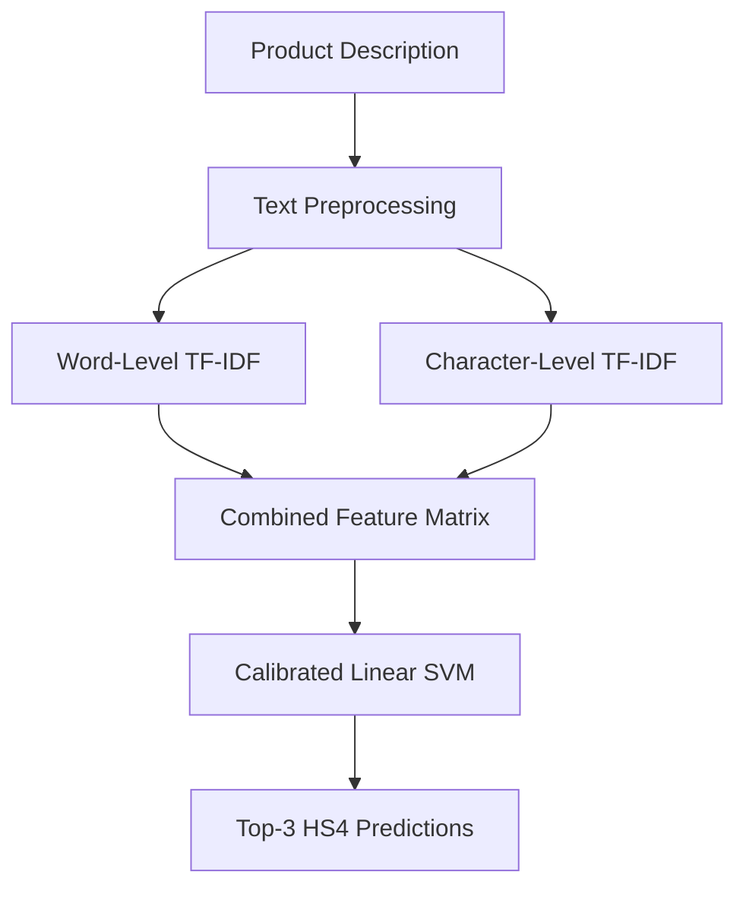

# HS4 Code Prediction

### Product Classification using NLP, TF-IDF and Calibrated Linear SVM

An NLP-based machine learning project that predicts the **4-digit Harmonized System (HS4) heading** from a product description.

The model returns a ranked list of three candidate codes to support human review, rather than making automatic customs-classification decisions.

## 🚀 Live Demo

**[Try the HS4 Code Prediction App](https://hs4-code-prediction-wampk2tvldwfbcgrfjmkfy.streamlit.app/)**

Enter a product description to view the model's top three predicted HS4 headings and their estimated confidence scores.

## 📌 Project Overview

Product classification requires understanding product descriptions and identifying relevant tariff headings. This project explores how traditional NLP and machine learning techniques can support that process.

### Workflow

## 📊 Model Performance

Evaluated on **2,976 held-out test samples** across 252 HS4 classes.

| Metric                  |     Result |
| ----------------------- | ---------: |
| Top-1 Accuracy          | **69.62%** |
| Top-3 Accuracy          | **81.69%** |
| Macro F1-score          | **0.5906** |
| Test Samples            |      2,976 |
| HS4 Classes             |        252 |
| Majority-Class Baseline |      7.09% |

**Top-1 accuracy** measures whether the first prediction matches the correct heading. **Top-3 accuracy** measures whether the correct heading appears among the model's three highest-ranked predictions.

## 🗂️ Dataset

The project uses the training split of a publicly available conversational tariff-classification dataset.

* [Dataset used in the project](https://huggingface.co/datasets/Dayanand314Krishna/cross_rulings_hts_dataset_for_tariffs)
* Original dataset: [CROSS Rulings HTS Dataset for Tariff Classification](https://huggingface.co/datasets/flexifyai/cross_rulings_hts_dataset_for_tariffs)

**Attribution:** “CROSS Rulings HTS Dataset for Tariff Classification by Flexify.AI Inc. (https://www.flexify.ai)”

The original records contain conversations in a `messages` field. The project extracts product descriptions and associated HS codes to build a text-classification dataset.

### Data Preparation

| Processing stage                         |    Records |
| ---------------------------------------- | ---------: |
| Original parsed records                  |     18,254 |
| Valid descriptions and codes             |     18,233 |
| After removing conflicting descriptions  |     17,509 |
| After exact duplicate removal            |     15,697 |
| Final dataset after rare-class filtering | **14,880** |

The final dataset was split into 11,904 training samples and 2,976 test samples using stratified sampling.

## 🧠 Model and Techniques

The final model combines:

* **Word TF-IDF:** Captures individual terms and two-word combinations.
* **Character TF-IDF:** Captures word patterns, spelling variations and technical terminology.
* **Linear SVM:** Classifies descriptions across the supported HS4 classes.
* **Probability calibration:** Produces estimates used to rank the top three candidate headings.
* **Stratified train/test split:** Evaluates performance on held-out samples.

A feature comparison showed that combining word and character features improved Top-1 accuracy from **66.70% to 69.62%** and Top-3 accuracy from **78.80% to 81.69%** on the same test split.

## 🔎 Error Analysis and Coverage

The project includes `test_predictions.csv` and `wrong_predictions.csv` to inspect model results and understand classification errors.

The source contained many distinct HS4 codes, but the final model supports 252 classes after data cleaning and filtering.

* **94.80% record-level coverage** across the eligible, deduplicated records before rare-class filtering.
* **45.99% distinct-code coverage** based on the codes identified in the parsed source.
* A small, manually selected stress test placed the expected heading in the Top-3 results for 7 of 12 cases.

These figures describe this dataset and the selected test cases; they do not establish performance across all possible products.

## ⚠️ Limitations

* The model can only predict HS4 classes represented in its training labels.
* Some product descriptions are ambiguous or contain multiple products.
* The extraction process selects the first HS4 code identified in an assistant response, which can introduce label noise.
* Confidence estimates should be treated as ranking aids, not guarantees of correctness.
* HS4 headings are not complete country-specific tariff codes.

**This project is for portfolio and educational purposes. It is not a substitute for official customs guidance or expert tariff classification.**

## 🛠️ Technologies Used

Python · Pandas · NumPy · Scikit-learn · TF-IDF · Linear SVM · Hugging Face Datasets · Joblib · Streamlit · Jupyter Notebook

## 📁 Project Files

| File                                                                                                                  | Purpose                                                         |
| --------------------------------------------------------------------------------------------------------------------- | --------------------------------------------------------------- |
| [`hs4_code_classifier.ipynb`](https://github.com/Ayesha-Ansa/hs4-code-prediction/blob/main/hs4_code_classifier.ipynb) | Data preparation, model training, evaluation and error analysis |
| [`app.py`](https://github.com/Ayesha-Ansa/hs4-code-prediction/blob/main/app.py)                                       | Streamlit prediction interface                                  |
| [`requirements.txt`](https://github.com/Ayesha-Ansa/hs4-code-prediction/blob/main/requirements.txt)                   | Python dependencies                                             |
| `model_info.pkl`                                                                                                      | Model metadata                                                  |
| `test_predictions.csv`                                                                                                | Predictions on the held-out test set                            |
| `wrong_predictions.csv`                                                                                               | Incorrect Top-1 predictions                                     |
| [`GitHub Releases`](https://github.com/Ayesha-Ansa/hs4-code-prediction/releases)                                      | Downloadable trained model artifact                             |

## 🔮 Potential Improvements

* Improve representation of underrepresented HS4 classes.
* Refine extraction for records containing multiple products or codes.
* Add explanations for individual predictions.
* Explore more advanced text-representation methods.

## 👩‍💻 Author

**Ayesha Ansari**

Data Science & AI | Machine Learning | NLP
